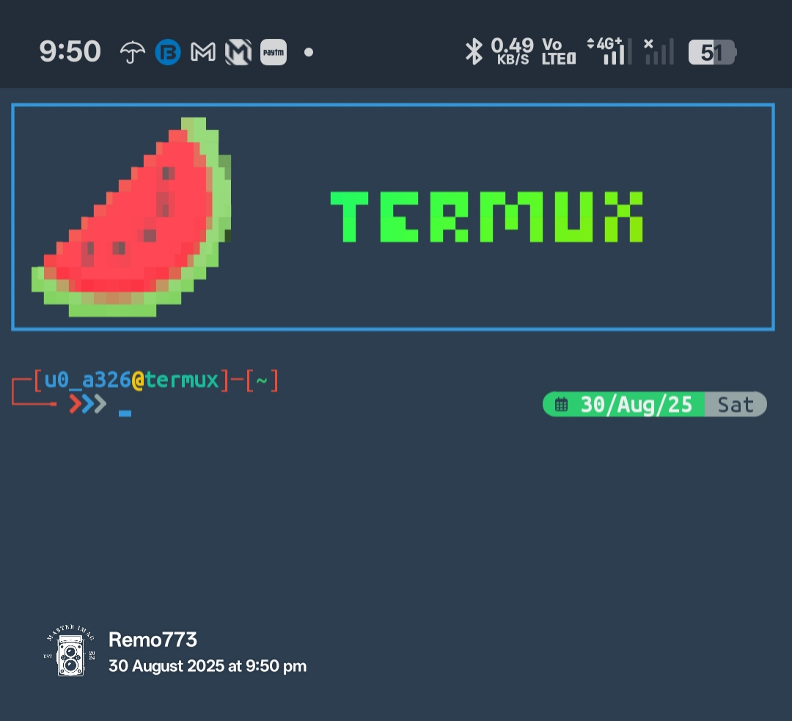

---

# ✨ T-Header: Premium Terminal Branding for Termux

---

Transform your Termux shell into a personalized, aesthetic command center with **T-Header** — a modular setup featuring custom headers, ZSH themes, logo art, and interactive menus.
## 🚀 Features

- 🎨 **Custom Logo & Title**: Display ASCII art logos and figlet-rendered titles with color gradients.
- 🧠 **Smart ZSH Setup**: Oh-My-Zsh integration with plugin manager and theme selector.
- 🧩 **Interactive Menus**: Powered by `fzf` and `gum` for intuitive selection.
- 🛠️ **One-Tap Setup**: Install all dependencies and configure your shell in minutes.
- 🧾 **Aliases & Enhancements**: Modern replacements for `ls`, `cat`, and more using `eza`, `bat`, `logo-ls`.

## Preview of after setup completed..


---

## 📦 Requirements

Make sure the following packages are installed:

```bash
pkg install curl fd figlet ruby boxes gum bat logo-ls eza zsh timg fzf
gem install lolcat
```

## 🧑‍💻 Installation

1. `apt update && yes | apt upgrade && apt update && apt install git fzf -y`
2. `git clone https://github.com/remo7777/T-Header.git`
3. `cd T-Header/`
4. `ls`
5. `bash t-header.sh`
6. after complete all processing just --open new session-- or `source ~/.zshrc`

This script will:

- Install required packages
- Set up ZSH and Oh-My-Zsh
- Apply custom fonts and themes
- Configure `.zshrc`, `.profile`, and `.aliases`

## 🧭 Usage

After installation, use the following commands:

| Command     | Description                  |
|------------|------------------------------|
| `theader`  | Launch interactive setup     |
| `clogo`    | Change logo                  |
| `ctitle`   | Set custom header title      |
| `ctpro`    | Switch `termux.properties`   |
| `cztheme`  | Change ZSH theme             |

## 🖼️ Preview

```bash
figlet -f pixelfont "T-Header" | lolcat
```

 <!-- Replace with actual screenshot if available -->

## 🧙‍♂️ Customization

- Logos stored in `~/.config/theader/logo`
- Themes in `~/.oh-my-zsh/custom/themes`
- Config file: `~/.config/theader/theader.cfg`

You can edit these manually or use the interactive menu.

## 🧼 Uninstall

```bash
rm -rf ~/.config/theader ~/.oh-my-zsh ~/.zshrc ~/.profile ~/.aliases
```

## 📜 License

MIT © [remo7777](https://github.com/remo7777)

---

